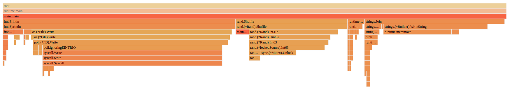
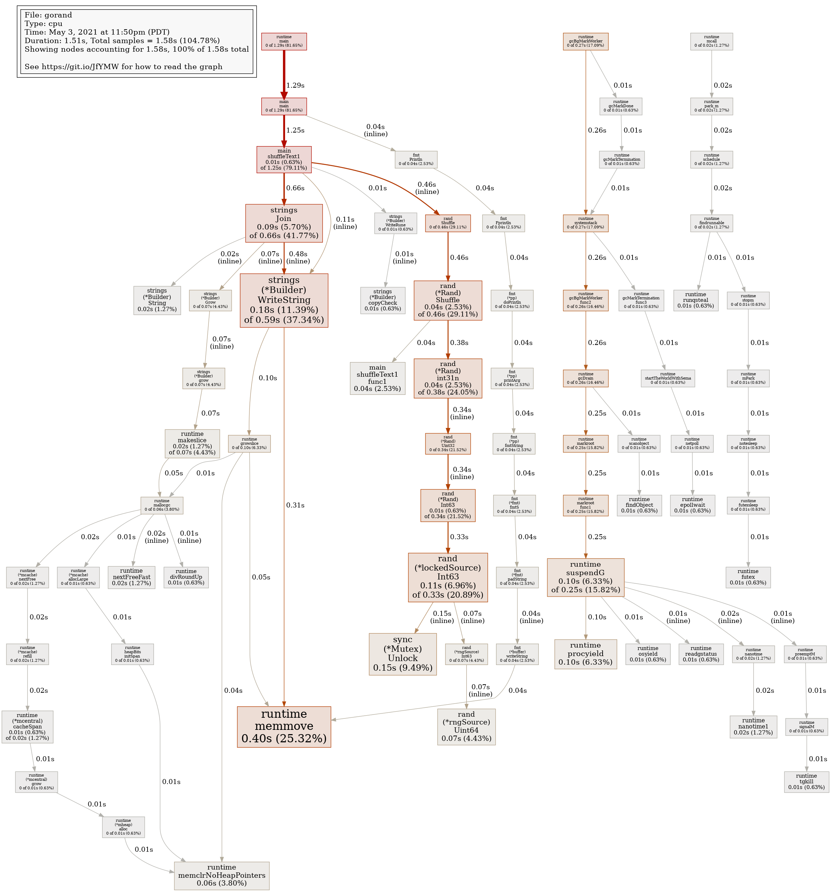
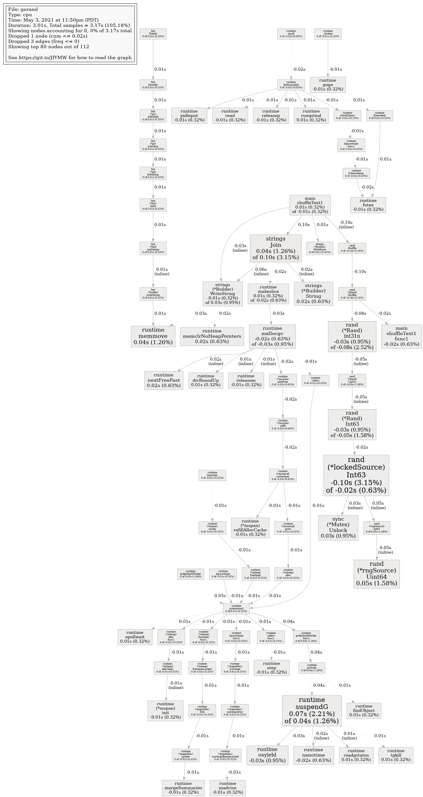

## Local install
```sh
go install -ldflags=-s
```
Output:
```
Optimization is is only is dilemma the code key Simple The reliable design truth the a success to source of
is a key of success Optimization code is design the The source truth the to reliable only is dilemma Simple
key code The the truth success Optimization is dilemma Simple design is to of only the is reliable source a
is is The to design Optimization the key success dilemma is only the reliable truth source of code Simple a
the of only design to a reliable dilemma code the is The success Simple is source key Optimization truth is
key truth the the Optimization is dilemma only of success source The code to design is Simple a reliable is
to the Simple truth is a is key success of code source design the reliable is The dilemma only Optimization
success is Simple to The design reliable code source Optimization truth is a of only is the dilemma key the
the reliable key The a source Simple to only of is truth code is dilemma design success Optimization the is
dilemma a code is design source is the reliable key success only The truth the is Simple of to Optimization
```


```
BenchmarkShuffleText2-8   	       1	1_233_933_015 ns/op	773968840 B/op	 1000067 allocs/op
BenchmarkShuffleText1-8   	       1	1_274_333_218 ns/op	773959568 B/op	 1000054 allocs/op
```

Notes:  
Reduce number of syscalls



